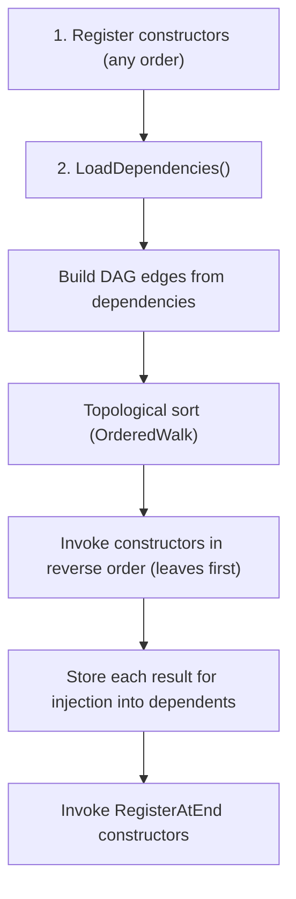
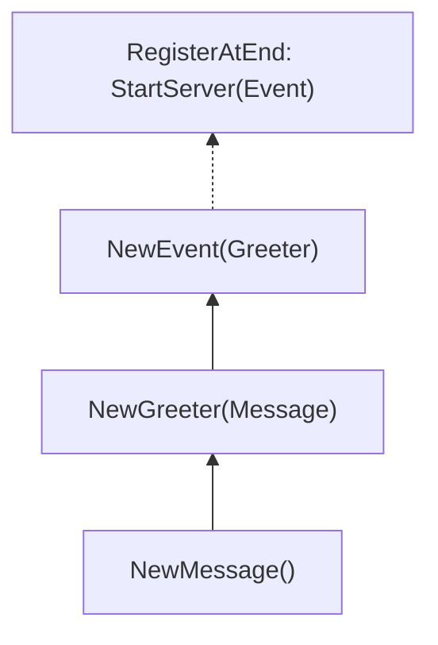

# Golang Minimalist Dependency Injection Framework 🪡

[](https://codecov.io/gh/Ignaciojeria/ioc)
[](https://goreportcard.com/report/github.com/Ignaciojeria/ioc)

## 🔧 Installation

    go get github.com/Ignaciojeria/ioc@latest

## 🧠 How it works



**Example dependency graph:**



The framework resolves this automatically — you register in **any order**, and it figures out: `NewMessage` → `NewGreeter` → `NewEvent` → `StartServer`.

## 👨‍💻 Quick Example

```go
package myapp

import "github.com/Ignaciojeria/ioc"

// Register dependencies in any order using var _ = pattern.
// The DAG resolves the correct initialization order.
var _ = ioc.Register(NewEvent, NewGreeter)
var _ = ioc.Register(NewGreeter, NewMessage)
var _ = ioc.Register(NewMessage)

type Message string

func NewMessage() Message {
	return Message("Hi there!")
}

type Greeter struct {
	Message Message
}

func NewGreeter(m Message) Greeter {
	return Greeter{Message: m}
}

type Event struct {
	Greeter Greeter
}

func NewEvent(g Greeter) Event {
	return Event{Greeter: g}
}
```

Then in your main:

```go
func main() {
	if err := ioc.LoadDependencies(); err != nil {
		log.Fatal(err)
	}
	fmt.Println("Dependencies loaded!")
}
```

## 🏗️ Advanced: Using a Container

For testing or multiple independent dependency graphs, create your own `Container`:

```go
c := ioc.New()

c.Register(NewMessage)
c.Register(NewGreeter, NewMessage)
c.Register(NewEvent, NewGreeter)

if err := c.LoadDependencies(); err != nil {
    log.Fatal(err)
}

// Reset the container for a clean slate (useful in tests).
c.Reset()
```

## 📌 API

| Function / Method | Description |
|---|---|
| `ioc.New()` | Create a new independent `Container` |
| `c.Register(ctor, deps...)` | Register a constructor and its dependencies |
| `c.RegisterAtEnd(ctor, deps...)` | Register a constructor to run after all others |
| `c.LoadDependencies()` | Resolve and invoke all constructors |
| `c.Reset()` | Clear all state (for testing) |
| `ioc.Register(...)` | Shortcut using the default global container |
| `ioc.RegisterAtEnd(...)` | Shortcut using the default global container |
| `ioc.LoadDependencies()` | Shortcut using the default global container |
| `ioc.Reset()` | Reset the default global container |

## 📜 License

MIT
