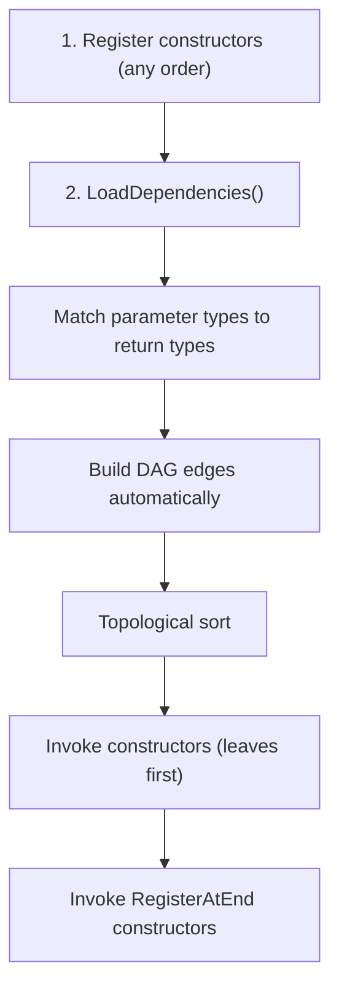
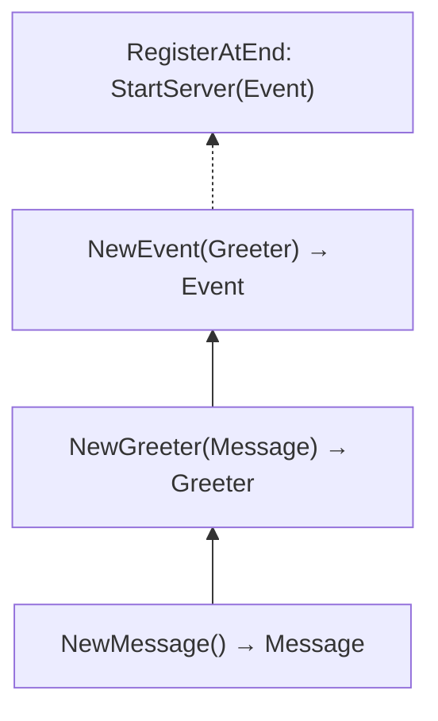

# Golang Minimalist Dependency Injection Framework 🪡

[](https://codecov.io/gh/Ignaciojeria/ioc)
[](https://goreportcard.com/report/github.com/Ignaciojeria/ioc)

## 🔧 Installation

    go get github.com/Ignaciojeria/ioc@latest

The framework **infers dependencies automatically** by matching parameter types to return types. No need to declare dependencies manually.

It also features **100% type-safety**, **ambiguous dependency detection**, and **IDE-clickable error traces** (`file:line`).

## 👨‍💻 Quick Example

```go
package myapp

import "github.com/Ignaciojeria/ioc"

// Just register constructors — dependencies are inferred by type.
var _ = ioc.Register(NewEvent)
var _ = ioc.Register(NewGreeter)
var _ = ioc.Register(NewMessage)

type Message string

func NewMessage() Message {
	return Message("Hi there!")
}

type Greeter struct {
	Message Message
}

func NewGreeter(m Message) Greeter {
	return Greeter{Message: m}
}

type Event struct {
	Greeter Greeter
}

func NewEvent(g Greeter) Event {
	return Event{Greeter: g}
}
```

Then in your main:

```go
func main() {
	if err := ioc.LoadDependencies(); err != nil {
		log.Fatal(err)
	}
	fmt.Println("Dependencies loaded!")
}
```

## 🧠 How it works



**Example dependency graph:**



## 📌 API

| Function | Description |
|---|---|
| `ioc.Register(ctor)` | Register a constructor (dependencies inferred by type) |
| `ioc.RegisterAtEnd(ctor)` | Register a constructor to run after all others |
| `ioc.LoadDependencies()` | Resolve the dependency graph and invoke all constructors |

## 📜 License

MIT
