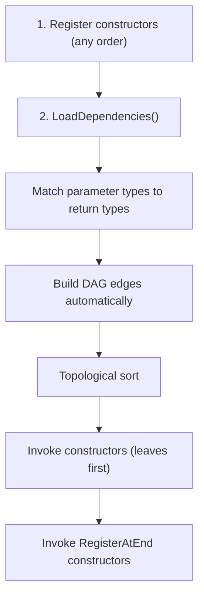
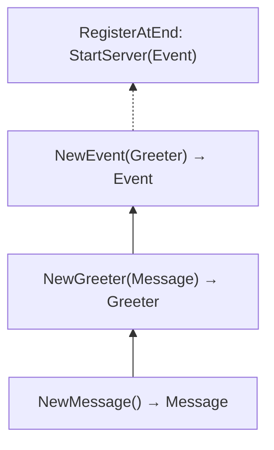

# Golang Minimalist Dependency Injection Framework 🪡

[](https://codecov.io/gh/Ignaciojeria/ioc)
[](https://goreportcard.com/report/github.com/Ignaciojeria/ioc)


## 🔧 Installation

    go get github.com/Ignaciojeria/ioc@latest

**Key Features:**
- **Automatic Inference**: Infers dependencies automatically by matching parameter types to return types. No need to declare them manually.
- **Package-Aware Matching**: Two types with the same name in different packages are treated as distinct dependencies.
- **Cycle-Free by Design**: Resolves dependencies using a Directed Acyclic Graph (DAG), ensuring your architecture remains strictly predictable and cycle-free.
- **Singleton Lifecycle**: All dependencies are instantiated exactly once as singletons and injected in topological order.
- **Flexible Registration**: Register interfaces, concrete implementations, or any type of function. Anything with an injectable return value is valid for registration.
- **Ambiguous Dependency Detection**: Detects and reports when multiple providers implement the same interface or type.
- **IDE-Clickable Error Traces**: Traces errors directly to the source (`file:line`).

## 👨‍💻 Quick Example

```go
package myapp

import "github.com/Ignaciojeria/ioc"

// Just register constructors — dependencies are inferred by type.
var _ = ioc.RegisterAtEnd(greetAtEnd)
var _ = ioc.Register(NewEvent)
var _ = ioc.Register(NewGreeter)
var _ = ioc.Register(NewMessage)

type Message string

func NewMessage() Message {
	return Message("Hi there!")
}

type Greeter struct {
	Message Message
}

func NewGreeter(m Message) Greeter {
	return Greeter{Message: m}
}

type Event struct {
	Greeter Greeter
}

func NewEvent(g Greeter) Event {
	return Event{Greeter: g}
}

func greetAtEnd(e Event) {
	fmt.Println(e.Greeter.Message) // Prints: "Hi there!"
}
```

Then in your main:

```go
func main() {
	// This will build the graph and trigger RegisterAtEnd constructors
	if err := ioc.LoadDependencies(); err != nil {
		log.Fatal(err)
	}
}
```

> 💡 **Important Note on Imports:** Go's compiler removes unused packages. If a package contains dependency registrations (via global variables) but its types aren't explicitly used elsewhere, you must include a blank import (`_ "yourproject/yourpackage"`) in your `main.go` so the compiler knows to include it and execute those registrations.

**Example: Global Logger Setup**

Here is a common scenario: configuring `slog` globally. Since no other package needs to import `logger` directly (they just use `slog` from the standard library), you must use a blank import in `main.go`.

```go
// logger/logger.go
package logger

import (
	"log/slog"
	"os"
	"github.com/Ignaciojeria/ioc"
)

// Register a void side-effect constructor
var _ = ioc.Register(setupLogger)

func setupLogger() {
	logger := slog.New(slog.NewJSONHandler(os.Stdout, nil))
	slog.SetDefault(logger)
}
```

```go
// main.go
package main

import (
	"log"
	"log/slog"
	"github.com/Ignaciojeria/ioc"
	
	// Blank import to trigger the logger registration
	_ "yourproject/logger"
)

func main() {
	if err := ioc.LoadDependencies(); err != nil {
		log.Fatal(err)
	}
	slog.Info("Dependencies loaded and logger is configured!")
}
```

## ✍️ Constructor Signatures

The framework is highly flexible and accepts various constructor return signatures:

- **Single Return (Type only):** The dependency is registered and cannot fail during initialization.
  ```go
  var _ = ioc.Register(NewServer)
  func NewServer() *http.Server {
      return &http.Server{Addr: ":8080"}
  }
  ```
- **Two Returns (Type and Error):** Ideal for components that can fail. If an error is returned, `ioc.LoadDependencies()` immediately halts and returns it.
  ```go
  var _ = ioc.Register(NewDB)
  func NewDB() (*gorm.DB, error) {
      return gorm.Open(postgres.Open(dsn), &gorm.Config{})
  }
  ```
- **Single Return (Error only):** Treated as a "side-effect constructor" that can fail. It provides no dependency to others, but its logic executes during initialization.
  ```go
  var _ = ioc.Register(SetupTracing)
  func SetupTracing() error {
      return otel.InitProvider() // OpenTelemetry example
  }
  ```
- **No Returns (Void):** Pure side-effect execution without error handling.
  ```go
  var _ = ioc.Register(setupLogger)
  func setupLogger() {
      slog.SetDefault(slog.New(slog.NewJSONHandler(os.Stdout, nil)))
  }
  ```

> ⚠️ **Note:** Constructors cannot return more than 2 values, and if they return exactly 2 values, the second one **must** be an `error`.

## 🛑 Graceful Shutdown

The framework natively supports graceful shutdowns through dependency injection. Just request the `ioc.Shutdowner` interface in your constructors:

```go
func NewPostgresDB(s ioc.Shutdowner) (*DB, error) {
    db, err := sql.Open("postgres", "...")
    if err != nil {
        return nil, err
    }
    
    // The framework auto-injects itself and registers your cleanup function
    s.RegisterShutdown(func() error {
        return db.Close()
    })
    
    return db, nil
}
```

Then in your entry point, call `ioc.Shutdown()` after receiving a termination signal. Cleanups are executed in **reverse order (LIFO)**.

```go
import (
    "log"
    "os"
    "os/signal"
    "syscall"
    "github.com/Ignaciojeria/ioc"
)

func main() {
    if err := ioc.LoadDependencies(); err != nil {
        log.Fatal(err)
    }
    // Wait for termination signal (e.g. Ctrl+C or Kubernetes SIGTERM)
    quit := make(chan os.Signal, 1)
    signal.Notify(quit, os.Interrupt, syscall.SIGTERM)
    <-quit 
    
    // Execute graceful shutdown
    if err := ioc.Shutdown(); err != nil {
        log.Fatalf("Shutdown errors: %v", err)
    }
}
```

## 🧠 How it works



**Example dependency graph:**



## 📌 API

| Function | Description |
|---|---|
| `ioc.Register(ctor)` | Register a constructor (dependencies inferred by type) |
| `ioc.RegisterAtEnd(ctor)` | Register a constructor to run after all others |
| `ioc.LoadDependencies()` | Resolve the dependency graph and invoke all constructors |
| `ioc.Shutdown()` | Execute all registered shutdown functions in reverse order (LIFO) |

## 📜 License

MIT
